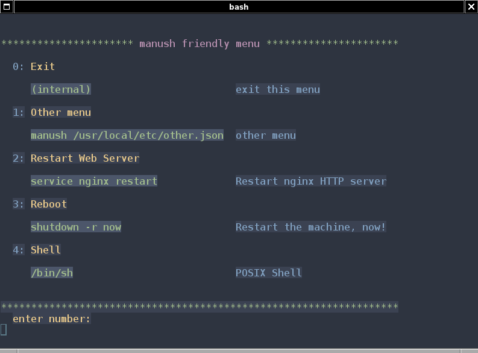

---


manush is a simple, configurable, secure menu shell.

It presents the list of configurable options to the user.  
Each option represents a command to run.  

## Installation

There are two ways to build manush.

First is by using vipack package manager. Therefore, the prerequisites are [voc](https://github.com/vishaps/voc) (vishap oberon compiler) and [vipack](https://github.com/vishaps/vipack) (vishap package manager).

Issue the following command in manush's directory:

```console
vipack -t $(pwd)/deptree -p manush -P $(pwd)
```

vipack should download all the necessary dependencies and build manush. You will find the resulting binary in the `build` directory.

The second way to build manush is by using the supplied Makefile. The Makefile is POSIX compatible.

## Configuration

manush needs to be started with exactly one command-line argument: The path of the configuration file.

In case no argument is provided, the default, `/usr/local/etc/manush.json` will be used. If the default configuration is not found either then manush will issue an error and exit.

manush will attempt to validate the configuration file with `jq`, which is the only runtime dependency it currently has.

For a sample configuration have a look at [`default.json`](templates/default.json)

It looks like this:

```json
{
"another menu":
    {
      "name": "Another Menu",
      "exec": "manush -c /usr/local/etc/manush/another.json",
      "cmnt": "Another Menu"
    },
"restart web server":
    {
      "name": "Restart Web Server",
      "exec": "service nginx restart",
      "cmnt": "Restart NGINX Server"
    },
"reboot":
    {
      "name": "Reboot",
      "exec": "shutdown -r now",
      "cmnt": "Reboot the Machine!"
    },
"shell":
    {
      "name": "Shell",
      "exec": "/bin/sh",
      "exitstatus": "false",
      "cmnt": "POSIX Shell"
    }
}
```

manush will always insert an `exit` command (internal) at the top of the menu.

Pro tip: you can have `manush /path/to/other_configuration_file.json` as one of the options, thus you may create menus with unlimited depth! (:

by default after the commnad execution, manush will show the exit status.
however, this option is configurable by json's "exitstatus" key.

it also won't show you the exit status if the program executed was another instance of manush.
